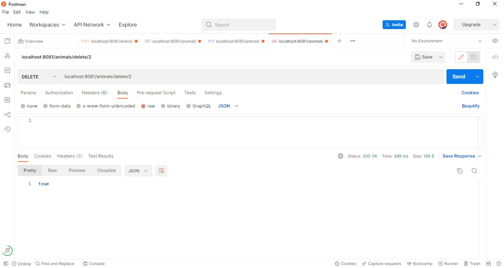

# DFEProject
* Why are we doing this?

_The task is to create a Spring Boot API, with utilisation of supporting tools, 
methodologies, and technologies, that encapsulates all fundamental and practical modules covered during training._

* How I expected the challenge to go.

_I expected to encounter some issues with my code and fix the errors by testing the code and figuring out mistakes._ 

* What went well? / What didn't go as planned?

_While working on the project I have realised that some tasks take longer to implement than expected while others take less time._
_For example testing CRUD functions required more effort whereas creating swagger documentation consumed less time than set on Jira board._
_I have also experienced CPU causing issues during the project implementation which slowed me down significantly for back-end-code development, specially in a process of adding annotations._
_For this reason some of tasks set to take lowest effort (2 points) took longer (I would set them to 8 or 10 points now)._
_I have planned to create and add an ERD diagram to my project and set this task to low priority in Jira, however later realised that the diagram would not be representative for the database I have because ERD is particularly useful for relational database which is not my case._
_Overall the project implementation went well and I could complete the project and all the MustHave tasks in time._

* Possible improvements for future revisions of the project.

I would add more tests to run so that testing would cover every code in the project.

* Screenshots showing your postman requests and the output from the API

* Screenshots of your database to prove that data is being persisted

* Screenshot of your test results, including coverage report

* [Link to my Jira Board](https://kateryna78.atlassian.net/jira/software/projects/DFEP/boards/4)
